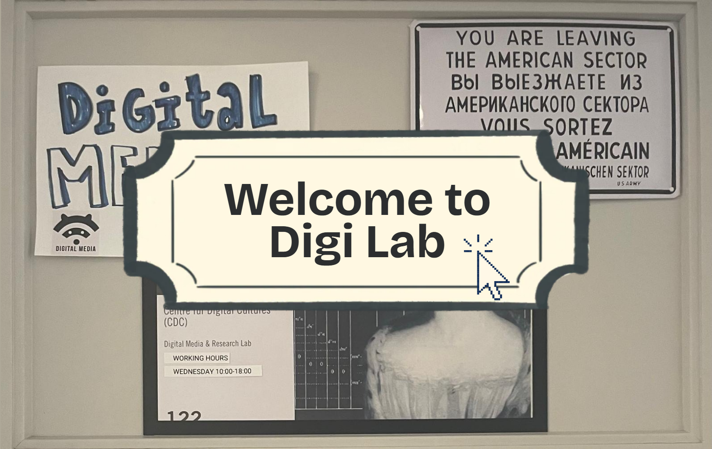
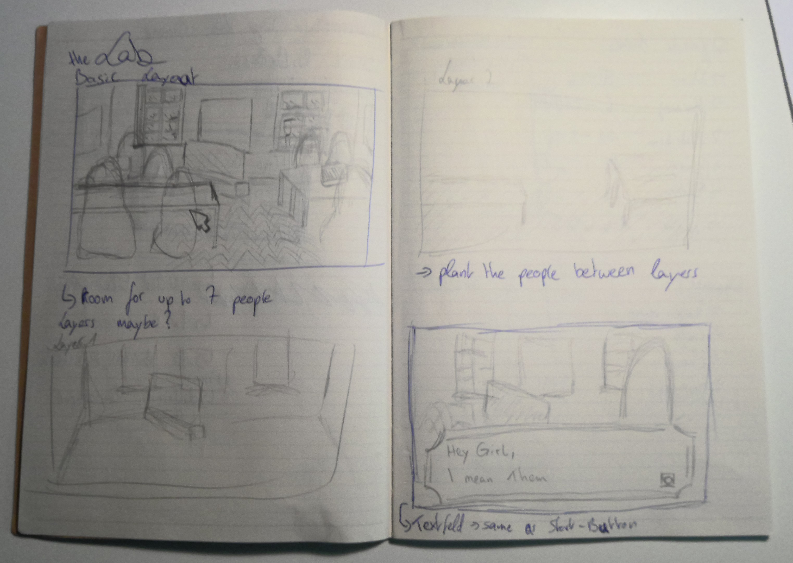
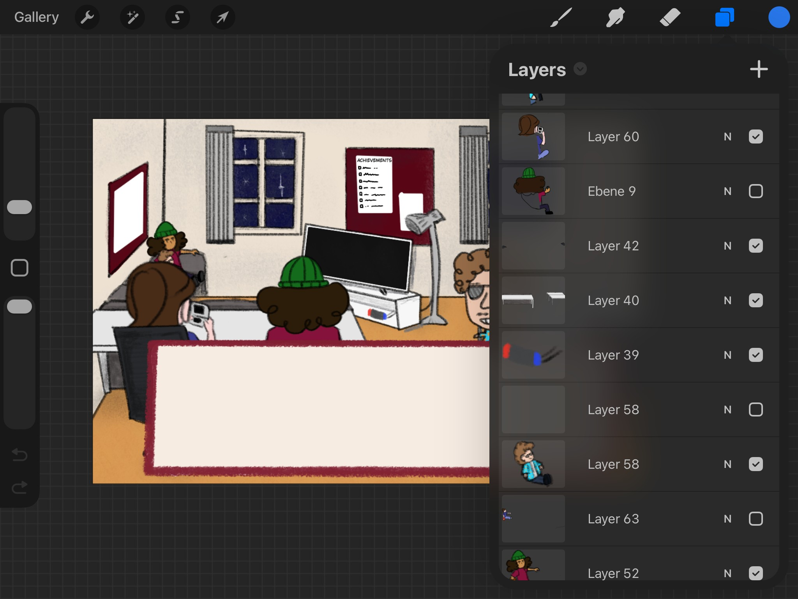
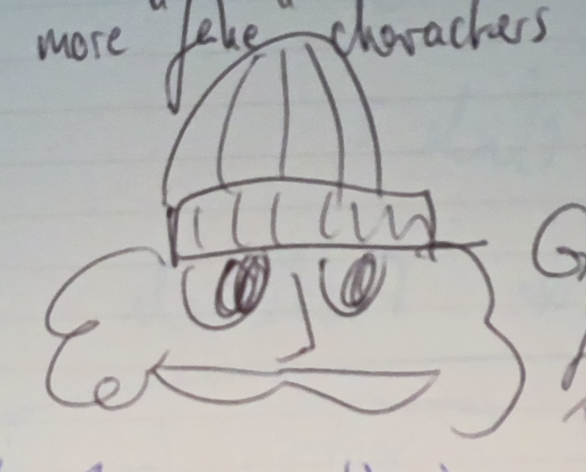
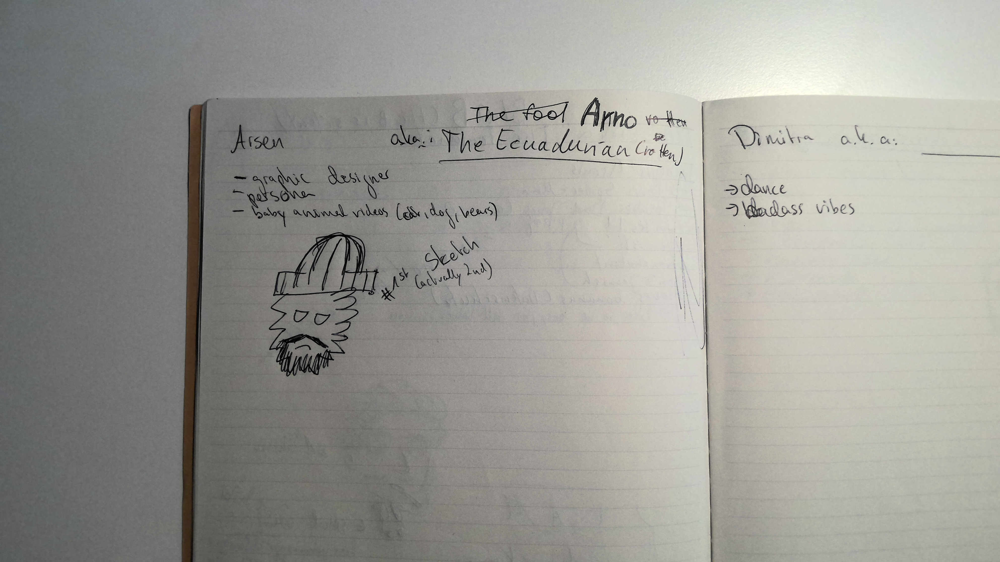
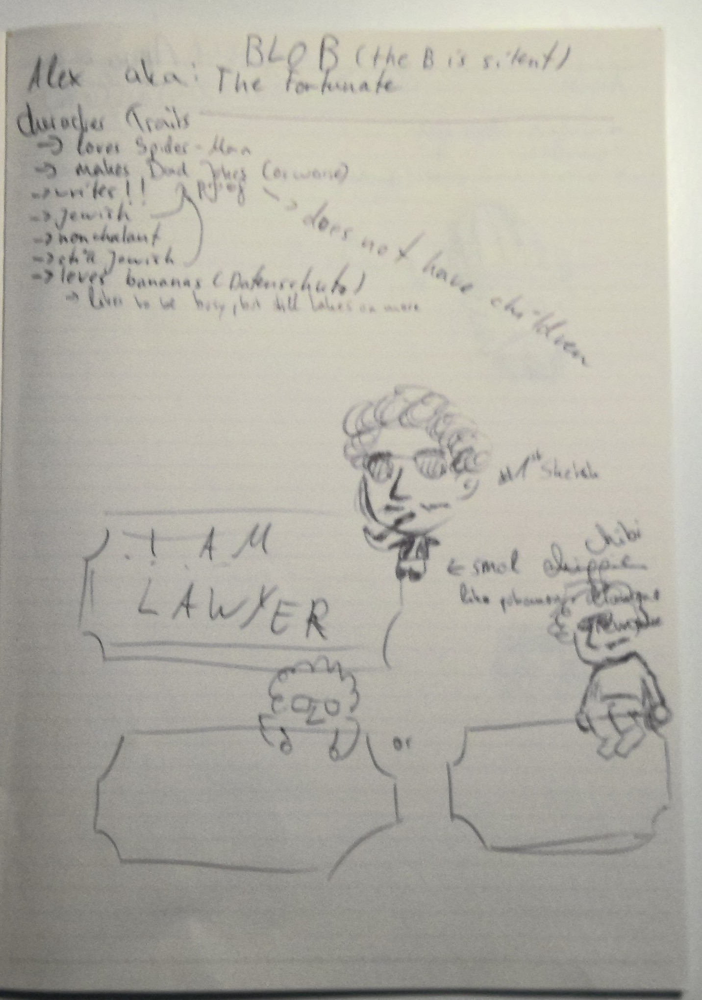
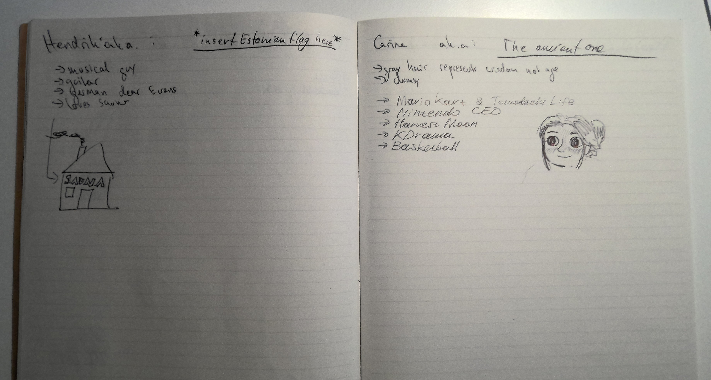
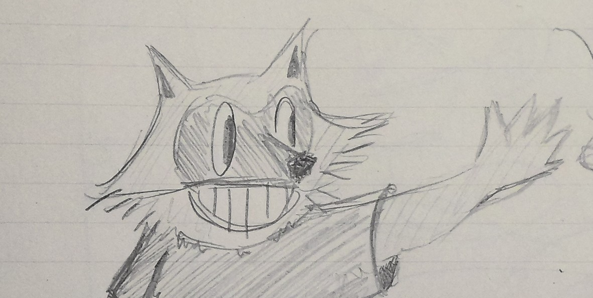
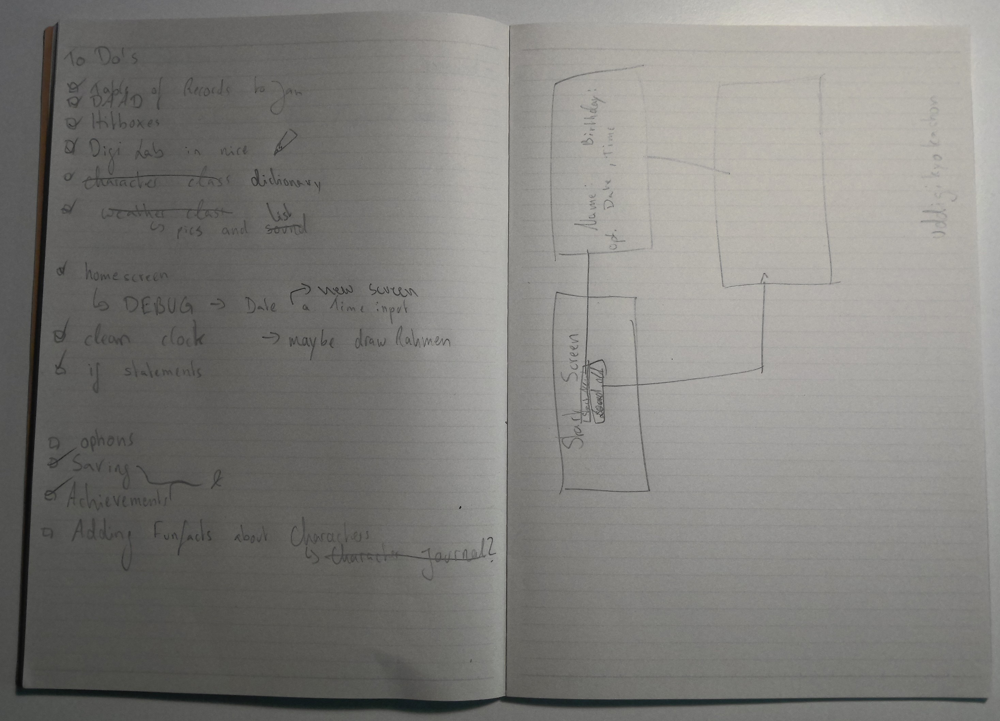

## Welcome to Digi Lab

[Beginnings](#beginnings)

[Drawing](#drawing)

[Characters](#characters)

[Coding Experience](#coding-experience)

[Resources and References](#resources-and-reference-links)

[Outlook and Reflection](#outlook-and-reflection)

### Beginnings
Before the Digital Media Lab Game became my idea, my first idea was way bigger but very similar in the sense that the key mechanics involve interacting with characters.
But then I backed down to an environment with characters I interact with often.
The Digital Media Lab as setting was set:

> These are my first drawings of how I wanted the game to look.

The final game still looks quite like the initial sketches.
Sadly, the DigiLab has changed its Location, so the actual Lab now looks a bit different.

### Drawing
I drew all the visuals myself in procreate:

### Characters

I may or may not have based my characters on actual human beings I know.
But I did not use their real names but let them choose how they wanted to be called.🥸
Those who know them might still be able to distinguish who is who.

> First and final design of Arno. I kinda like this version more than the colored one, which almost made me do the game in black and white.

> Every character got a side in my notebook. I wrote their names and some little fun facts which I can implement in their dialogue.

> Blob his character sheet.

> Brooke her character sheet. (And someone's who still needs to be added)

>A charecter I would like to draw and implement as soon as possible. The Digi mascot raccoon! 🦝
> 
>The most secret character. You need to trigger an event to get him to visit Lab regularly. (only implemented in my mind, not the game (yet))

There is lots more characters on my list that I want to implement in the future.

### Coding Experience

I started with the easy stuff:
- setting a screen size 
- setting a simple game loop
- screen.blitting the image 

I also researched a lot on how to make a clock. My simplified version was then amplified by GeminiAI to make it possible to use realtime as well as chosen time.

Then I started researching, which was not as easy because pygame is not usually used for dialogue heavy game. 
Then I found a source about how to make textboxes and found this link [here]( https://github.com/benedsmith/PyTextBox/tree/master).

To my luck this class also included a function colliding with which I could create my HitBox class. 
For the dialogue itself I later chose to make my own function. Which took the text lines, rendered them and screen.blit them at the right position.

Then I wanted to start a simple loop that would first show the startscreen image then the lab and then dialogue screen, but I had massive problems figuring out how to make separate loops. Until I spoke with Lab Manager Cil, who gave me the idea of creating different screen classes. I searched for a code I could use online and found this [here](https://github.com/ArtBIT/pygame-template/tree/main/src).
This made it relatively easy to adapt my screens.

The files saving was relatively easy since the only things that need to be saved are player name, Birthday and the Achievement process.

I really needed to sit down a longer time to be really getting something done. It took a while before I had enough knowledge to actually code something, and even longer to figure out how to make it work in my setting.
Especially since I was working 30h in the weeks which left small time frames to really sit down and get my head into python and pygame.

### Resources and Reference Links

Clock
https://handhikayp.medium.com/generate-a-simple-digital-clock-with-python-tkinter-796a5b298872
https://www.pygame.org/docs/ref/time.html

Game Loop and Game States
https://github.com/ArtBIT/pygame-template/tree/main/src

HitBox
https://github.com/benedsmith/PyTextBox/tree/master

The DropDown is completely made by AI. I first did a simple writing input block, but I felt like a dropdown would be way nicer.

AI also helped me a lot with the Menu and the SlotSelectionScreen.

When there were more complicated fixes I did ask AI for solutions.

In the end I also let GeminiAI look over my code for a clearer construction of my code.

### Outlook and Reflection

>To Do's

This game is a very simple base game of what it can be. You don't need to play long to achieve everything. (Especially if you use the time and weather controls).
There is alot missing to make it feel like a real game someone would want to play. 
I would also like to structure the code slightly differently for the Dialogue and the Events, so it is easier to add content. (For example based on more specific hours of the day or the season.)
Or make different characters interact with each other.

It would also be nice to add more things to the LabLocation, like the minigame on the TV I proposed in the intermediate presentation.

More advanced would also be the idea to add a journal in which the player can write down information about the characters.
Then I would add dialogue options based on this information, where the player can earn or loose friendship points.

I also would like to add more events. For example, I had an event in mind where the player enters DigiLab at midnight and a black figure is watching a movie. 
This figure would be the raccoon who is normally hiding from Students because he is not allowed in the Lab.

I would add Storylines to the character, so it feels like there is progress made. For example getting to know the raccoon and at some point introducing him to the Lab Manager. So the raccoon goes from being at Lab only at ungodly hours to all hours.

But for the time I had for this project I think I managed well to produce a functioning base game with little insider jokes that makes it fun for friends to play.
More content would not necessarily add more code since the foundation is already there.

Features that would add more significant code and would add more fun and goals to the game:

- Answer options
- Friendship points
- Character Journal
- Minigame (on the TV)

